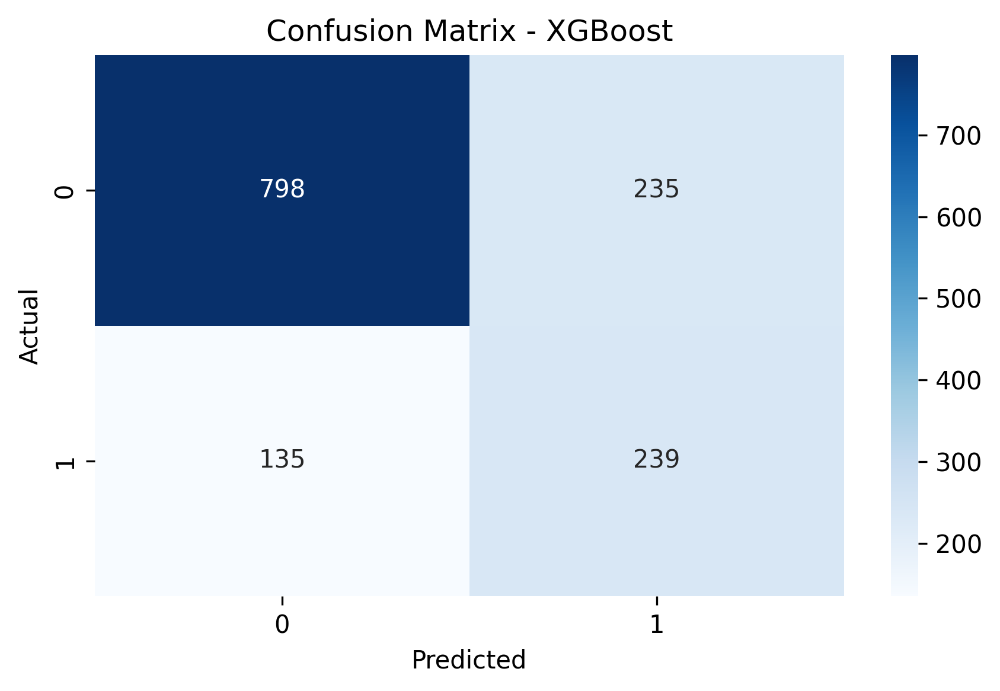
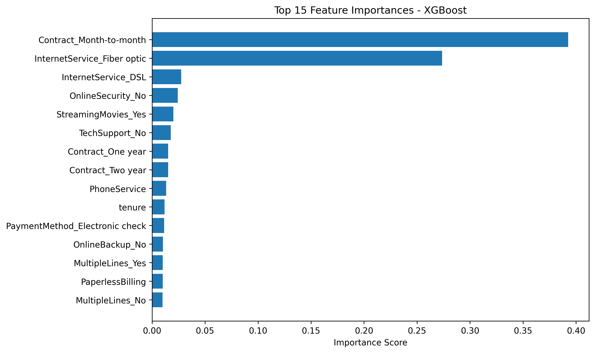

# Customer Churn Predictor

Predict whether a customer is likely to leave a service using machine learning.
This project uses the Telco Customer Churn dataset from Kaggle and includes data preprocessing, feature engineering, model training, evaluation, and saving the final model.

## Project Structure

```
customer-churn-predictor/
├── data/                 # Raw dataset (from Kaggle)
├── notebooks/           # Jupyter notebooks for exploration and modeling
├── scripts/             # Future space for automation scripts
├── models/              # Saved model files (e.g., XGBoost, CatBoost)
├── outputs/             # Evaluation results, plots, confusion matrices
├── requirements.txt     # List of Python packages
├── README.md            # Project overview
└── .gitignore           # To ignore large files/models
```

## Dataset

- **Source:** [Kaggle - Telco Customer Churn](https://www.kaggle.com/datasets/blastchar/telco-customer-churn)
- **Target Variable:** `Churn` (Yes/No) → Converted to binary (1/0)

## Models Trained

- Logistic Regression (baseline)
- Logistic Regression with class balancing
- Logistic Regression with SMOTE
- Random Forest Classifier
- XGBoost Classifier
- CatBoost Classifier

## Best Model

- **XGBoost Classifier**: Balanced accuracy with strong recall on churned customers.
- Model saved to: `models/xgb_churn_model.pkl`

## Visual Results

The following plots were generated during evaluation and saved in the `outputs/` folder:

### Confusion Matrix


### Feature Importances


## Setup Instructions

```bash
python3 -m venv venv
source venv/bin/activate
pip install -r requirements.txt
```

Run Jupyter Notebook:

```bash
jupyter notebook
```

## Requirements

- Python 3.10+
- pandas, numpy, matplotlib, seaborn
- scikit-learn
- imbalanced-learn
- xgboost
- catboost

All dependencies listed in `requirements.txt`

## License

This project is licensed under the MIT License. See the [LICENSE](LICENSE) file for details.

---
